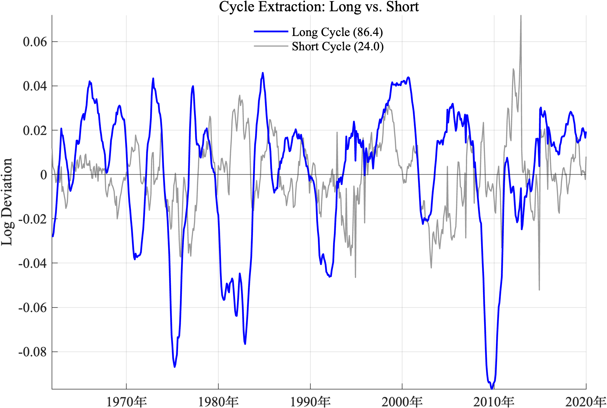
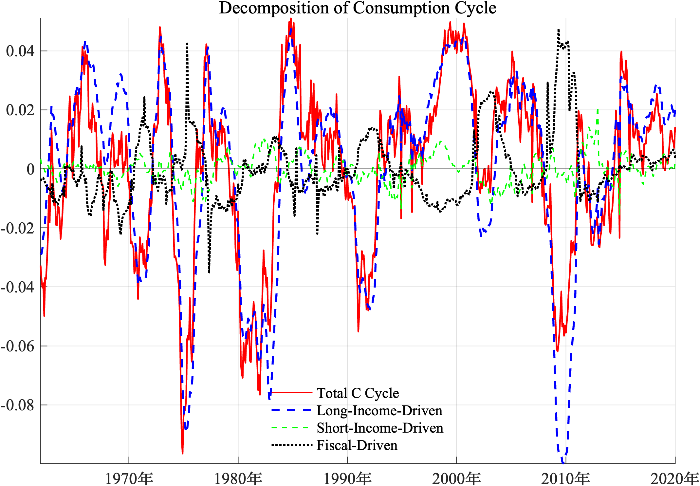

# 不同经济周期下的美国消费—收入关系

> 基于 MATLAB 状态空间模型，研究美国居民消费对长、短周期收入波动的不同反应，并结合失业率与财政转移支付进行识别。

## 项目概览

居民消费既会受到长期收入预期的影响，也会受到短期就业、流动性和政策环境的扰动。如果只用一个平均系数描述消费与收入的关系，可能会掩盖不同周期之间的差异。

本项目使用美国月度宏观数据，将市场收入分解为长周期和短周期，分别估计居民消费对两类波动的敏感度。同时，引入失业率缺口作为劳动力市场“锚”，并将财政转移支付从市场收入中单独拆分出来。

项目覆盖了较完整的实证研究流程，包括数据清洗、平稳性检验、Hamilton 滤波、HP 滤波、状态空间建模、约束极大似然估计、稳健性检验和结果可视化。

## 完整报告

如需了解研究动机、模型推导、参数估计、稳健性检验和文献讨论，可直接查看[完整报告](完整报告.pdf)。

## 主要结论

| 周期成分 | 估计周期 | 消费敏感度 | 奥肯系数 |
|---|---:|---:|---:|
| 长周期 | 约 86.4 个月 | 1.031*** | -0.368*** |
| 短周期 | 约 24.0 个月 | 0.296*** | 0.034（不显著） |

注：`***` 表示估计结果在 1% 水平上显著。

这里的“消费敏感度”表示：收入周期偏离趋势 1% 时，消费周期平均变化多少。

- 消费与收入在长周期上的联动明显强于短周期，说明居民对持续性较强的收入变化反应更充分。
- 基准模型中的状态依赖系数并不显著（`p = 0.706`）。因此，相比简单区分“危机期/正常期”，从周期频率入手更能解释样本中的差异。
- 双周期模型中的转移支付系数为正（`γ = 0.541`），表明转移支付与消费波动存在正向条件相关关系。由于转移支付本身会随经济状况变化，这一结果不能直接解释为因果意义上的财政乘数。
- 长周期奥肯系数为负且显著，为周期识别提供了劳动力市场依据；短周期奥肯系数在主模型中不显著，因此本文不对短周期冲击作过强的结构性解释。

完整参数和稳健性检验见 [`results/RESULTS.md`](results/RESULTS.md)。





## 研究流程

1. 构造实际消费、实际可支配收入、市场收入和转移支付因子。
2. 检查消费—收入关系，并对调整后的残差进行平稳性检验。
3. 使用收入、消费和失业率缺口估计三变量基准状态空间模型。
4. 将单周期模型扩展为长、短双周期模型。
5. 调整周期边界和测量误差约束，检验结果是否稳健。
6. 输出适合阅读和展示的结果图与参数表。

模型方程和解释边界见 [`docs/METHODOLOGY.md`](docs/METHODOLOGY.md)。

## 项目结构

```text
data/
  US_Data.csv              美国月度宏观数据
src/
  prepare_data.m           数据处理与平稳性检验
  baseline_model.m         单周期三变量基准模型
  dual_cycle_model.m       长、短周期扩展模型
  export_figures.m         结果图导出脚本
results/
  figures/                 300 DPI 结果图
  RESULTS.md               参数估计与稳健性结果
docs/
  DATA_DICTIONARY.md       数据定义、单位和来源
  METHODOLOGY.md           模型设定与局限性
```

本地仍保留开发笔记、参考文献和其他模型版本，但这些材料没有进入公开仓库，以免干扰主线。

## 运行方法

代码已在 MATLAB R2024a 下通过静态检查。需要安装：

- MATLAB；
- Econometrics Toolbox；
- Optimization Toolbox；
- Statistics and Machine Learning Toolbox。

在 MATLAB 中打开仓库根目录，依次运行：

```matlab
run('src/prepare_data.m')
run('src/baseline_model.m')      % 基准模型
run('src/dual_cycle_model.m')    % 双周期扩展模型
run('src/export_figures.m')      % 在双周期模型之后运行
```

模型先使用 `fminsearch` 搜索较好的初始值，再通过 `fminunc` 进行优化，完整估计可能需要数分钟。数据处理脚本会在 `data/processed/` 下生成 `prepared_data.mat`，该中间文件不会提交到 Git。

## 数据与样本

原始 CSV 覆盖 1959 年 1 月至 2025 年 9 月。为了避开疫情期间的极端结构变化，并复现论文中的归档结果，模型使用前 733 个月，即 1959 年 1 月至 2020 年 1 月。

这一截止日期比严格的“2019 年底”多一个月。由于现有结果图来自该归档设定，仓库选择如实披露，而不是在未重新估计模型的情况下静默修改样本。

模型使用 DSPI、PCE、PCEPI、W875RX1 和 UNRATE 等 FRED 公开序列，具体定义与来源见[数据字典](docs/DATA_DICTIONARY.md)。

## 主要特点

- 从宏观变量出发，将经济问题转化为可估计的计量模型；
- 识别不同周期成分，避免只依赖单一总量指标判断经济状态；
- 将收入、消费、就业和财政转移支付放在同一框架下分析；
- 对统计显著性、模型识别和因果解释保持必要区分。

## 局限性

- 周期分解依赖具体模型设定，不能直接视为结构性冲击识别。
- 财政转移支付具有内生性，估计系数不等同于因果财政乘数。
- 原始研究流程没有保存准确的数据下载日期和 FRED 历史版本。
- 完整非线性模型可能受到初始值、参数边界和测量误差设定的影响。

## 声明

本仓库仅用于学术研究和个人作品展示，不构成任何投资建议。
